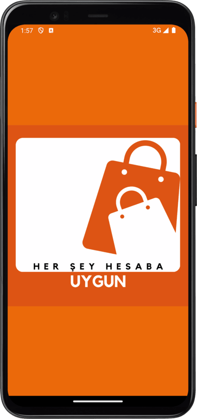
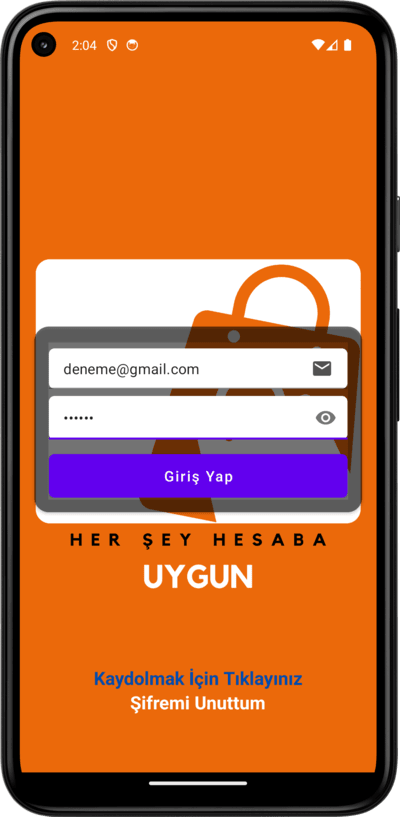
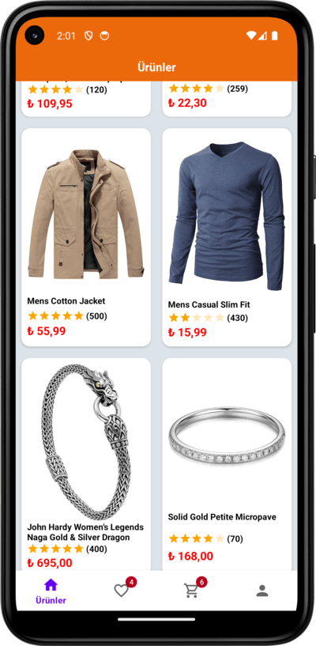
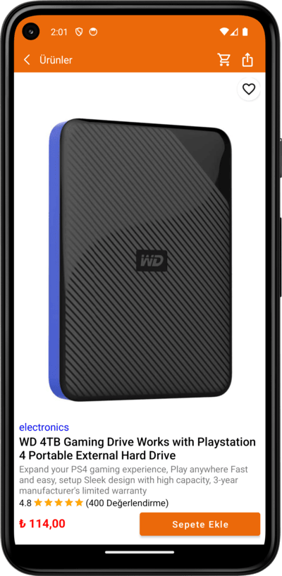
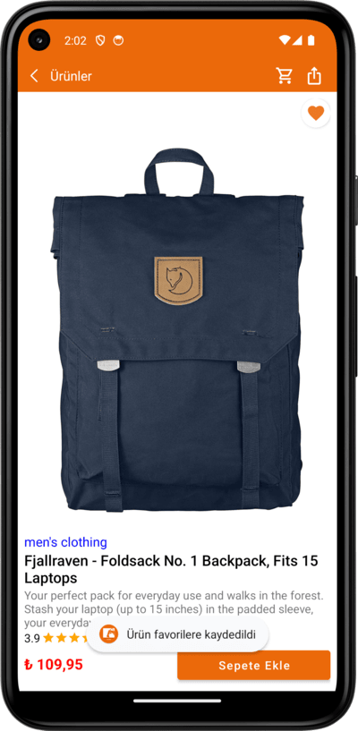
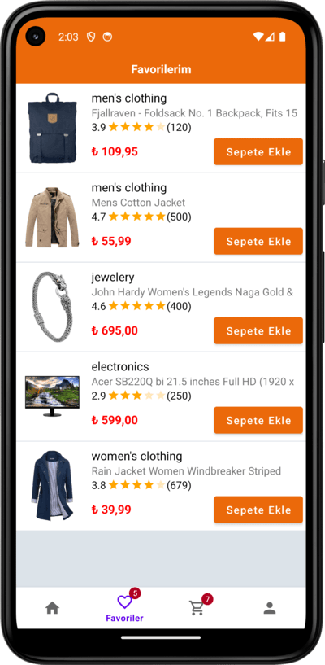
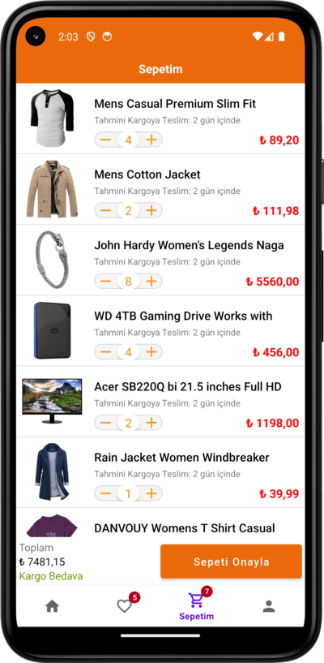

# Uygun

## Kullanılan Teknolojiler 
* Activity, Fragment, Navigation, ViewModel
* Retrofit, LiveData
* MVVM  
* RecyclerView  

**Projenin Amacı**  

*Kaydolarak kullanıcı oluşturabildiğimiz ve kullanıcı girişi yaparak kullanabildiğimiz bir uygulama. Giriş yapıldıktan sonra ürünleri listeli bir şekilde görüntüleyip, ürünlerin detaylarına gidebiliriz. Ürün detay ekranında ilgili ürünü favorilere ekleme çıkarma ve sepete ekleme işlemleri yapabiliriz. Favorilerim ve Sepetim ekranlarında ürünleri görüntüleyebiliriz. Ayrıca Favorilerim ekranında da favori ürünlerimizi sepete ekleyebiliriz. Sepette ürün adetini artırıp azaltabilirken, sepetten tamamen de kaldırabiliriz. MVVM(Model-View-ViewModel) mimarisiyle Kotlin dilinde bireysel olarak geliştirdiğim bu projemde Firebase Authentication ve Realtime Database teknolojilerini kullandım.*  

